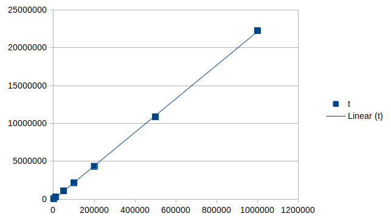
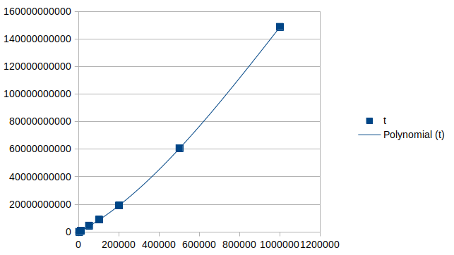
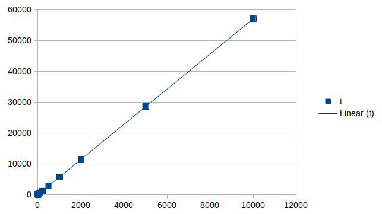

# P02

## 1.

### a)

Complexidade temporal: *T(n) = O(n)*\
Complexidade espacial: *S(n) = O(1)*

### b)

Complexidade temporal: *T(n) = O(n^2)*\
Complexidade espacial: *S(n) = O(1)*

Empiricamente a complexidade temporal parece não alinhar com a complexidade temporal teórica, isto pode ser devido a testes mal concebidos.

### c)

Complexidade temporal: $T(n) = O(n^3)$\
Complexidade espacial: $S(n) = O(1)$

## 2.

### a)

Complexidade temporal: *T(n) = O(n)*\
Complexidade espacial: *S(n) = O(1)*

### b)

Complexidade temporal: *T(n) = O(2^n)*\
Complexidade espacial: *S(n) = O(n)*

## 3.

### a)

Complexidade temporal: *T(n) = O(n^2)*\
Complexidade espacial: *S(n) = O(1)*

### b)

Complexidade temporal: *T(n) = O(n^2)*\
Complexidade espacial: *S(n) = O(1)*
